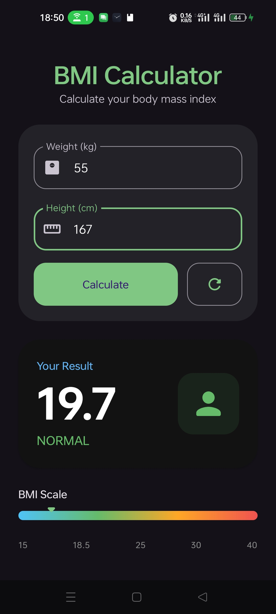
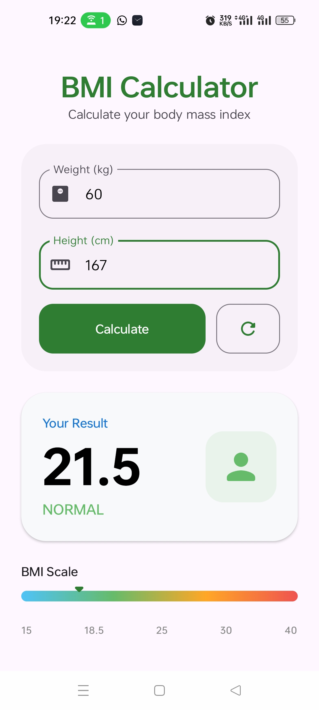

# BMI Calculator - Android (Jetpack Compose)

A modern, clean, and intuitive Body Mass Index (BMI) calculator for Android. Built with **Kotlin** and **Jetpack Compose**, this application follows the **MVVM (Model-View-ViewModel)** architectural pattern to ensure a clean separation of concerns and a responsive user experience.

## ✨ Features

- **Instant Calculation:** Get your BMI results immediately by entering your weight (kg) and height (cm).
- **Dynamic Status Feedback:** Automatically categorizes your BMI into *Underweight*, *Normal*, *Overweight*, or *Obese*.
- **Visual BMI Scale:** A custom-drawn gradient scale with a marker that visually represents where your BMI falls within the standard ranges.
- **Modern UI/UX:**
    - Built with **Material 3** components.
    - Smooth enter/exit animations for result cards using `AnimatedVisibility`.
    - Support for **Dark and Light themes** with a professional color palette.
- **Smart Input:** Uses appropriate keyboard types and manages the software keyboard automatically.
- **One-Tap Reset:** Quickly clear all inputs and results to start over.

## 🛠 Tech Stack & Architecture

- **Language:** [Kotlin](https://kotlinlang.org/)
- **UI Framework:** [Jetpack Compose](https://developer.android.com/jetpack/compose) (Material 3)
- **Architecture:** MVVM (Model-View-ViewModel)
- **State Management:** Compose State & Android ViewModel
- **Animation:** Compose Animation API
- **Theme:** Custom Material3 Theme with Dynamic Color support disabled for consistent branding.

## 📂 Project Structure

```text
com.example.bmicalculator/
├── model/           # Data models and BMI calculation logic
│   └── BmiData.kt   # BmiData class and utility functions (calculateBMI, getStatus)
├── viewmodel/       # UI Logic and State Management
│   └── BmiViewModel.kt
├── ui/              # Composable UI Components
│   ├── BmiScreen.kt # Main screen layout
│   ├── BmiResultCard.kt # Specialized components for results and scale
│   └── theme/       # Design system (Color, Type, Theme)
└── MainActivity.kt  # App entry point and Scaffold setup
```

## 🚀 Getting Started

Follow these instructions to get a copy of the project up and running on your local machine for development and testing purposes.

### Prerequisites

Before you begin, ensure you have the following installed:
* **Android Studio Hedgehog (2023.1.1)** or newer.
* **JDK 17** or higher (usually bundled with Android Studio).
* An **Android Device** or **Emulator** running API 24 (Android 7.0) or higher.
* **Git** installed on your system.

### 📥 1. Clone the Repository

Open your terminal or command prompt and run the following command to clone the project directly:

```bash
git clone https://github.com/Noro18/BMIcalculator.git
```

If you have **forked** the repository, replace `example` with your GitHub username:

```bash
git clone https://github.com/yourusername/BMIcalculator.git
```

### 🛠️ 2. Open and Setup in Android Studio

1. Launch **Android Studio**.
2. Select **Open** and navigate to the directory where you cloned the project.
3. Select the root folder `BMIcalculator` and click **OK**.
4. Wait for Android Studio to finish the **Gradle sync**. This might take a few minutes as it downloads the necessary dependencies.
5. If prompted to install any missing SDK platforms or build tools, follow the on-screen instructions.

### 🏃 3. Run the Application

1. Connect your physical Android device via USB (with **USB Debugging** enabled) or start an **Android Virtual Device (AVD)** from the Device Manager.
2. Select your device from the dropdown menu in the toolbar.
3. Click the green **Run** button (or press `Shift + F10`).
4. The app will build and install on your device/emulator.

## 📸 Screenshots

<div align="center">
  
  <p><i>The modern BMI Calculator interface in action</i></p>
</div>

<div align="center">
  
  <p><i>The modern BMI Calculator interface in action</i></p>
</div>


---
*Created with ❤️ using Jetpack Compose.*
